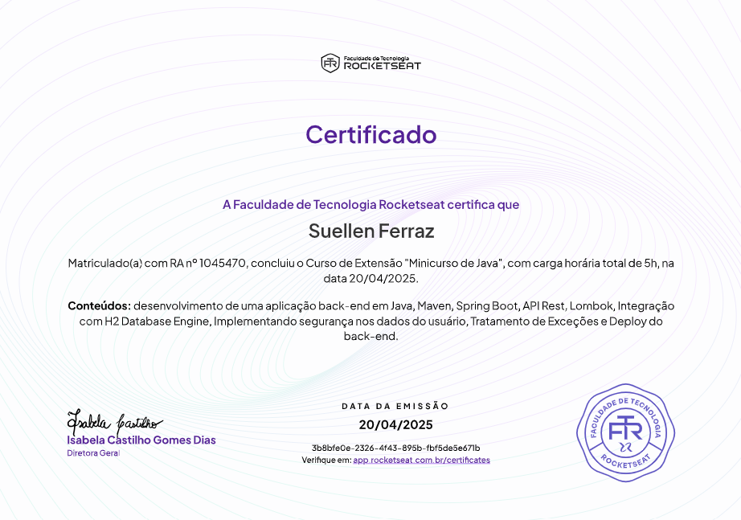

# To-Do List API - Java com Spring Boot

Este projeto é uma API de gerenciamento de tarefas (To-Do List) desenvolvida em Java utilizando o framework Spring Boot. O desenvolvimento foi realizado como parte do curso ["Java com Spring Boot - Curso Introdutório"](https://app.rocketseat.com.br/journey/java-com-spring-boot-curso-introdutorio/overview) da Rocketseat.

## Sobre o Curso

O curso aborda o desenvolvimento de uma API RESTful do zero, utilizando Java e Spring Boot, com foco em conceitos essenciais para quem está começando no desenvolvimento backend com Java. Entre os tópicos abordados estão:

- Criação de rotas HTTP (GET, POST, PUT)
- Validação de parâmetros
- Integração com banco de dados (H2 em memória)
- Autenticação de usuários (com filtro e hash de senha)

## O que foi feito neste projeto

- Estruturação de um projeto Spring Boot com Maven.
- Implementação de entidades para usuários e tarefas.
- Criação de repositórios JPA para persistência dos dados.
- Implementação de controllers para manipulação das rotas de usuários e tarefas.
- Validação de dados e regras de negócio (ex: datas das tarefas, unicidade de usuário).
- Hash de senha utilizando BCrypt.
- Filtro de autenticação para rotas protegidas.
- Configuração do banco de dados H2 para ambiente de desenvolvimento.
- Organização do código seguindo boas práticas do Spring Boot.

